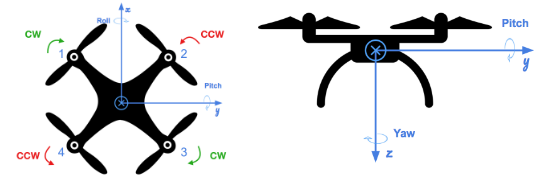
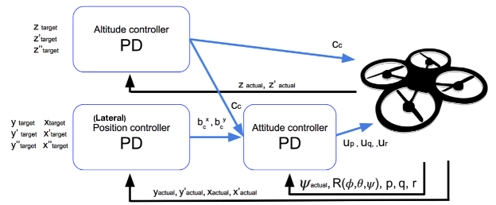
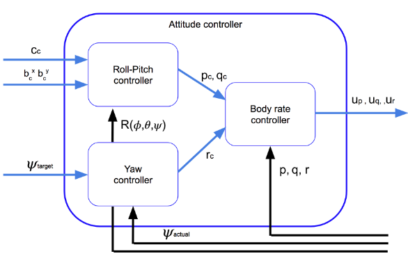
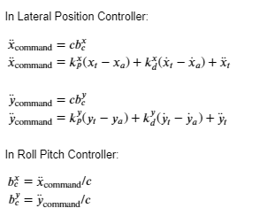
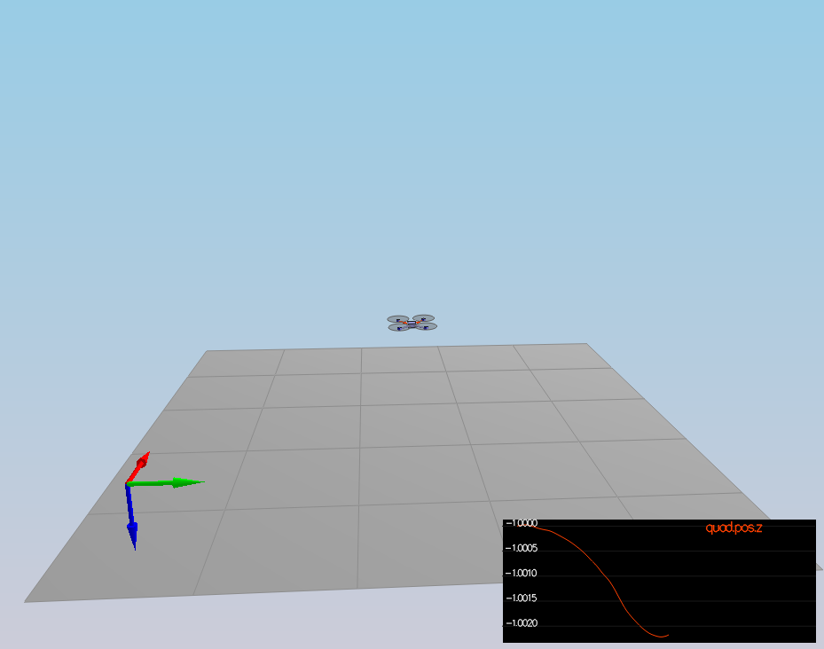
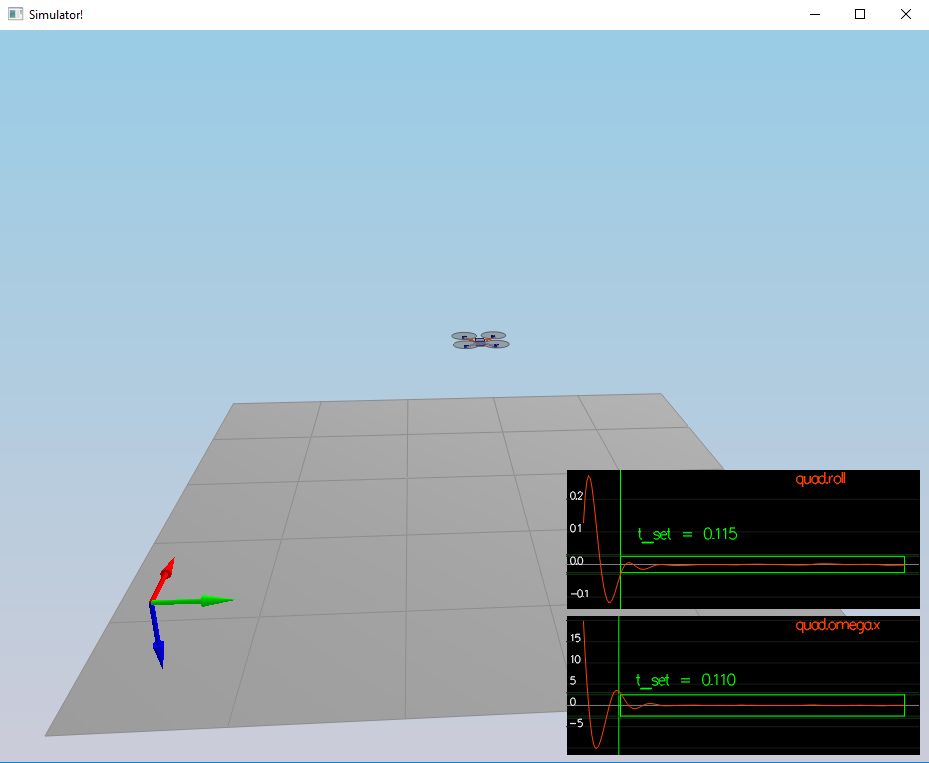
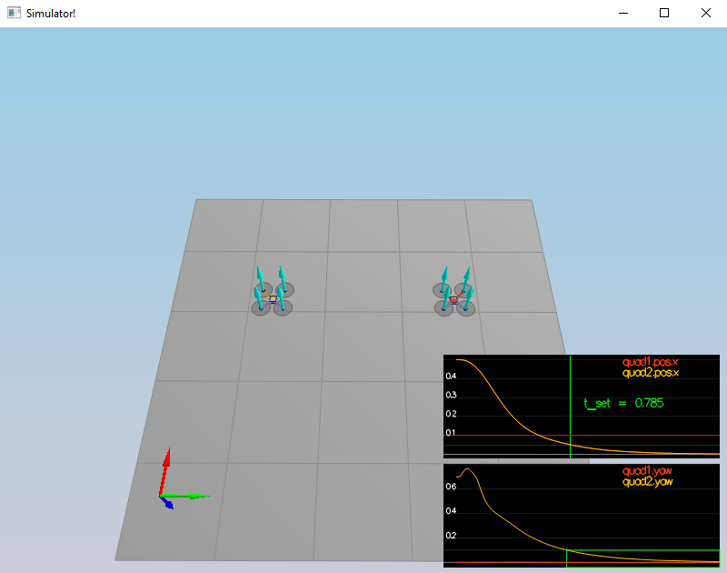
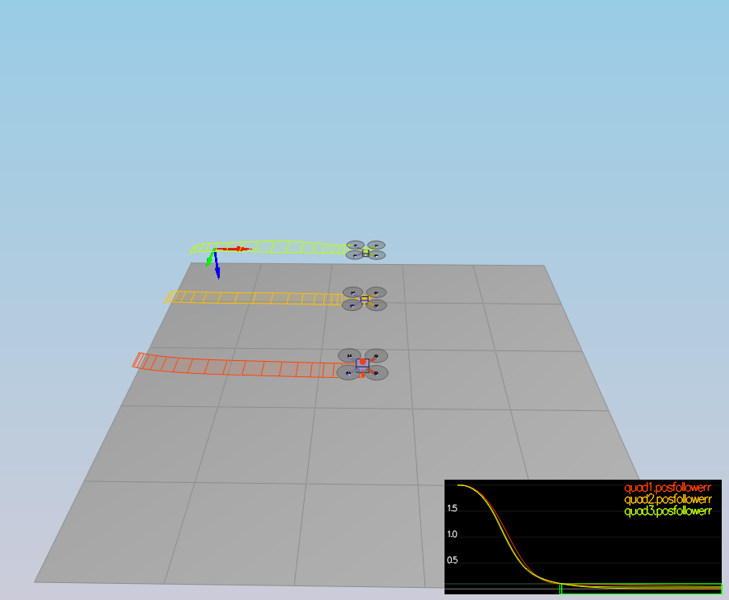
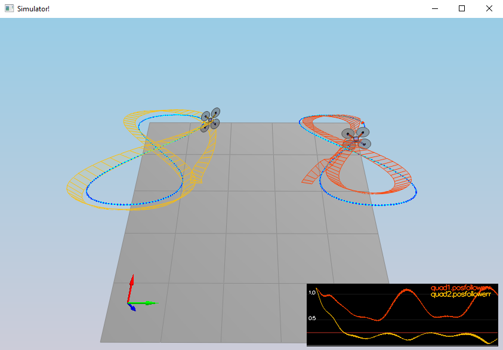

# Flying Car: 3D Control

## Overview



The 3D Control project is the third project in the Udacity Flying Car Nanodegree. In this project, our goal is to implement a cascaded PD controller with an structure similar to the control architecture shown in the image below.



The Attitude Controller is further detailed in the image below:



The sections below correspond to the project [rubric](https://review.udacity.com/#!/rubrics/1643/view) and outline how each requirement was satisfied.

*Note: The 3 images above were provided by the course*


<br/>

## Project Setup

In order to get this project to run on your machine, follow the Development Guide Setup section  in the original [README](./README_FromParentRepo.md) from the [parent repo](https://github.com/udacity/FCND-Controls-CPP). 

<br/>

## Project Details

### Implement Controller

#### 1. Implemented body rate control in C++.

This method determines the commanded 3-axis moment for the vehicle. As input, this method receives the current 3-axis body rate `pqr` and desired 3-axis body rate `pqrCmd`. Both inputs are supplied as a 3-tuple using the V3F data type.

To get the difference between the rate and desired body rates, using the V3F type, we are able to perform this calculation in a single operation:

```c++
V3F rateError = pqrCmd - pqr;
```

Next, we get the moment of inertia (as `MOI`) as a V3F for the next step: 

```c++
V3F MOI = V3F(Ixx, Iyy, Izz);
```

Finally, the commanded moment is MOI * k_m * rateError. The k_m is the 3-axis constant of proportionality.

```c++
momentCmd = MOI * (kpPQR * rateError);
```

#### 2. Implement roll pitch control in C++.

This method determines the roll and pitch angle rates for the vehicle. As input, this method receives a commanded acceleration as a V3F (roll and pitch only), the vehicle attitude as a Quaternion and a collective thrust command. This controller is implemented as a P controller.

In order to convert between the world frame and body frame, a rotation matrix will be required. There is provided code to perform this translation between the provided vehicle attitude in Quaternions and a rotation 3x3 matrix:

```c++
Mat3x3F R = attitude.RotationMatrix_IwrtB();
```

The first task is to make sure that the thrust command is positive. If it is zero or negative, then I just return a value of zero for pitch and roll.

Finally, I apply the following formula to get the roll and pitch angle rates:


The formula implemented in code:

```c++
//calculate error rates in the inertial frame
float vertAccel = collThrustCmd / mass;
float b_x_c = -CONSTRAIN(accelCmd.x / vertAccel, -maxTiltAngle, maxTiltAngle);
float b_y_c = -CONSTRAIN(accelCmd.y / vertAccel, -maxTiltAngle, maxTiltAngle);
float b_x_a = R(0, 2); // R13
float b_y_a = R(1, 2); // R23
float b_dot_x_c = kpBank * (b_x_c - b_x_a);
float b_dot_y_c = kpBank * (b_y_c - b_y_a);

// using attitude data, convert inertial 
// rates into body frame rates
float R11 = R(0, 0);
float R12 = R(0, 1);
float R21 = R(1, 0);
float R22 = R(1, 1);
float R33 = R(2, 2);

pqrCmd.x = (R21 * b_dot_x_c - R11 * b_dot_y_c) / R33;
pqrCmd.y = (R22 * b_dot_x_c - R12 * b_dot_y_c) / R33;
```

The minimum and maximum tilt angles have been limited based on the supplied limit parameters for the system.

#### 3. Implement altitude controller in C++.

This method determines the vertical thrust required given the current vehicle attitude, commanded vs. actual altitude, commanded vs. actual vertical velocity, feed forward vertical acceleration command and current timestep.

This controller is implemented as a full PID controller. I am globally (at a global class level) tracking the integrated altitude error which is also used as input data.

First, calculate proportional, integral and differential components:

```c++
//proportional
float zErr = posZCmd - posZ;
float p = kpPosZ * zErr;

//integral
integratedAltitudeError += zErr * dt;
float i = KiPosZ * integratedAltitudeError;

//differential
float zErrDot = velZCmd - velZ;
float d = kpVelZ * zErrDot;
```

Then, calculate vertical acceleration with full PID:

```c++
//PID control + accel feed-forward
float uBar1 = p + i + d + accelZCmd;
float R33 = R(2, 2);
float zDotDot = (uBar1 - CONST_GRAVITY) / R33;
```
Constrain acceleration between max descent/ascent rates for vehicle:

```c++
zDotDot = CONSTRAIN(zDotDot, -maxDescentRate / dt, maxAscentRate / dt);
```

Then, derive commanded vertical (flip sign for acceleration to indictate down = positive z direction):

```c++
thrust = mass * -zDotDot;
```

#### 4. Implement lateral position control in C++.

This method determines the commanded acceleration in x/y given the current vs desired lateral position, current vs. desired lateral velocity and lateral feed forward acceleration. 

This method will use a PD controller to output lateral acceleration commands in the x/y direction that will be used as input to the Roll Pitch Controller. The Roll Pitch Controller then will convert those accelerations into to b_x_c and b_y_c.

Ultimately, this will generate lateral acceleration by changing the vehicle's body orientation. The attitude change will then result in an a thrust in the desired direction.

The control equations are:



First, calculate the commanded velocity component and limit it to the max speed:

```c++
// Position (apply Max Speed)
V3F velXYCmd = kpPosXY * (posCmd - pos);
if (velXYCmd.magXY() > maxSpeedXY)
    velXYCmd = velXYCmd.norm() * maxSpeedXY;
```

Then, calculate the commanded accelerations while limiting it to the max acceleration:

```c++
accelCmd += kpPosXY * (posCmd - pos) + kpVelXY * (velCmd - vel);

if (accelCmd.magXY() > maxAccelXY)
    accelCmd = accelCmd.norm() * maxAccelXY;
```

#### 5. Implement yaw control in C++.

This method determines the yaw rate in rad/s given a current and commanded yaw, given in radians. This controller will be implemented as a P controller.

First, we need to make sure that the rate part in radians that is less than a full rotation. We use fmod for this purpose to get the fractional (remainder) part):

```c++
float twoPi = 2.f * F_PI;
float yawCmdNew = fmod(yawCmd, twoPi);
```

Then, determine the error rate:

```c++
float yawError = yawCmdNew - yaw;

if (yawError > F_PI)
    yawError -= twoPi;
else if (yawError < -F_PI)
    yawError += twoPi;
```

Then, determine the rate command in rad/sec:

```c++
yawRateCmd = kpYaw * yawError;
```

#### 6. Implement calculating the motor commands given commanded thrust and moments in C++.

This method converts the commanded moments and vertical thrusts, which were outputs from the other controllers into a single set of thrust commands, one per motor.

For the first part, I needed to determine the 4 thrusts overall, 3 for the moments and 1 for the vertical thrust.

```c++
	float l = L / sqrt(2.f);

	float rollThrust = momentCmd.x / l;
	float pitchThrust = momentCmd.y / l;
	float yawThrust = -momentCmd.z / kappa;
	float vertThrust = collThrustCmd;
```

Next, I needed to apply each of those thrusts to each motor. This required that I determine the direction that the force was being applied (+/-), depending on the motor involved and the force involved.

I left a cheat sheet as a comment in my code so I could determine which force was being applied in which direction depending on the motor pair (in the case of the moments) and divided equally in the case of the vertical thrust command.

```c++
	/*
	    roll (x-axis):  1&4 vs 2&3
	    pitch (y-axis): 1&2 vs 3&4
	    yaw (z-axis): 1&3 (+) vs 2&4 (-) 
	    vertical: +1, +2, +3, +4
	*/
```

Finally, I ended up with the following code, applying the forces to each motor. I labelled each motor in the code since in this implementation the 3rd and 4th rotors were labelled differently than the convention used in the course.

```c++
// front left (Rotor 1)
cmd.desiredThrustsN[0] = (rollThrust + pitchThrust + yawThrust + vertThrust) / 4.f; 

// front right (Rotor 2)
cmd.desiredThrustsN[1] = (-rollThrust + pitchThrust - yawThrust + vertThrust) / 4.f; 

// rear left (Rotor 4)
cmd.desiredThrustsN[2] = (rollThrust - pitchThrust - yawThrust + vertThrust) / 4.f;

// rear right (Rotor 3)
cmd.desiredThrustsN[3] = (-rollThrust - pitchThrust + yawThrust + vertThrust) / 4.f; 
```


### Flight Evaluation

#### 1. Your C++ controller is successfully able to fly the provided test trajectory and visually passes inspection of the scenarios leading up to the test trajectory.

---



##### Scenario #1

Upon initial setup, and after accounting for the proper weight of the vehicle, this scenario passed. Later this would pass again once GenerateMotorThrusts() was implemented:

```
Simulation #1876 (../config/1_Intro.txt)
PASS: ABS(Quad.PosFollowErr) was less than 0.500000 for at least 0.800000 seconds
```

---



##### Scenario #2: Body Rate and Roll/Pitch Control

Next, we implemented Body Rate Control and Roll Pitch Control. Upon successful tuning of the parameters, a successful run resulted:

```
Simulation #2519 (../config/2_AttitudeControl.txt)
PASS: ABS(Quad.Roll) was less than 0.025000 for at least 0.750000 seconds
PASS: ABS(Quad.Omega.X) was less than 2.500000 for at least 0.750000 seconds
```

---



##### Scenario #3: Position/Velocity and Yaw Angle Control

Next, we implemented Position and Velocity control and tuned the corresponding parameters. Upon completion, a successful run resulted:

```
Simulation #75 (../config/3_PositionControl.txt)
PASS: ABS(Quad1.Pos.X) was less than 0.100000 for at least 1.250000 seconds
PASS: ABS(Quad2.Pos.X) was less than 0.100000 for at least 1.250000 seconds
PASS: ABS(Quad2.Yaw) was less than 0.100000 for at least 1.000000 seconds
```


---




##### Scenario #4: Non-Idealities and Robustness

For this scenario, we had 3 quadrotors with the following conditions:

* Quad #1 (red): vehicle is heavier than usual
* Quad #2 (orange): vehicle is an ideal quad
* Quad #3 (green): vehicle has its center of mass shifted back

*Note: The order is as they are in the scenario (though they are laid out in the opposite order on the screen)*

By tuning the parameters and implementing the integral component in the AltitudeControl() to compensate for cummulative error over time, I was able to compensate for the extra heavy vehicle. 

Beyond that, this scenario required tuning following parameters:

```c++
# Position control gains
kpPosXY = 25
kpPosZ = 50
KiPosZ = 20

# Velocity control gains
kpVelXY = 10
kpVelZ = 20
```

Upon completion we got the following feedback:

```
Simulation #1401 (../config/4_Nonidealities.txt)
PASS: ABS(Quad1.PosFollowErr) was less than 0.100000 for at least 1.500000 seconds
PASS: ABS(Quad2.PosFollowErr) was less than 0.100000 for at least 1.500000 seconds
PASS: ABS(Quad3.PosFollowErr) was less than 0.100000 for at least 1.500000 seconds
```

---



##### Scenario #5: Tracking Trajectories

For the final scenario, there were 2 quads that are following a figure 8 trajectory. 

This scenario passed, as shown by the result:

```
Simulation #89 (../config/5_TrajectoryFollow.txt)
PASS: ABS(Quad2.PosFollowErr) was less than 0.250000 for at least 3.000000 seconds
```